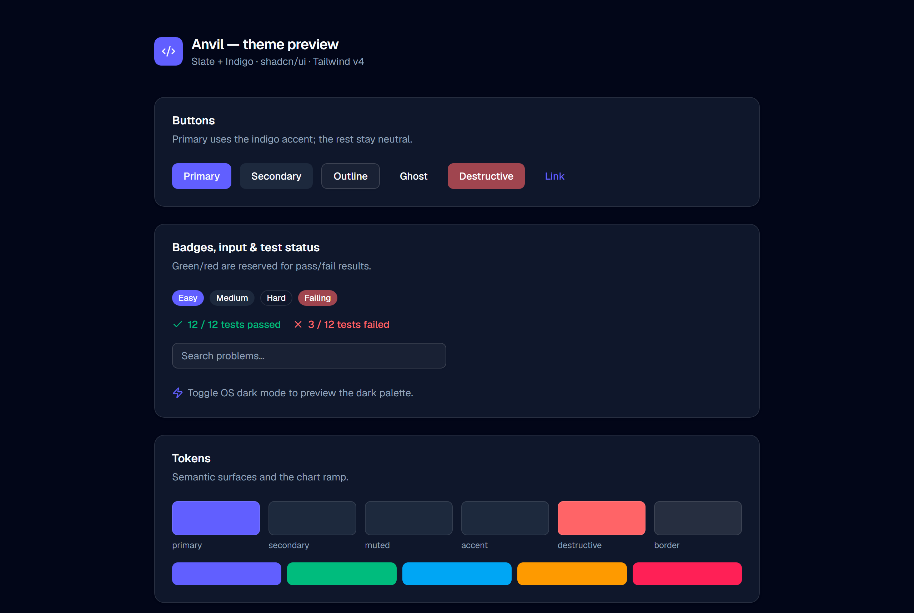

<div align="center">


[](https://github.com/kudzaiprichard/anvil/actions/workflows/ci.yml)
[](./LICENSE)
[](https://tauri.app)
[](https://nextjs.org)
[](./CONTRIBUTING.md)

</div>

# Anvil

**Offline-first desktop app for coding-interview / DSA practice.** Read a problem, write code in the
app, and run it against test cases locally — no internet and no account required.

Anvil pairs NeetCode-style, pattern-first learning with local code execution: structured practice
with 100% original problems you can run and test on your own machine, plus the ability to author your
own.

> **Status: in active development.** The desktop shell, the sandboxed local code runner (Python &
> JavaScript), and the offline test-pack judging system (2,900+ verified packs) work today. The
> problem library ships **empty** — you supply your own catalog of statements locally; see
> [Problem content & legal](#problem-content--legal). The full workspace UI, progress tracking, and
> practice modes are being built out on the roadmap below.

## Preview

> The interface below is the current **design-system preview** (theme + base components). Product
> screens arrive with the roadmap.

<p align="center">
  
</p>

## Tech stack

| Layer | Technology |
|---|---|
| UI | [Next.js 16](https://nextjs.org) (App Router, static export) · React 19 · TypeScript |
| Styling | [Tailwind CSS v4](https://tailwindcss.com) · [shadcn/ui](https://ui.shadcn.com) (new-york) |
| Theme | Custom Slate + Indigo (OKLCH) · light/dark via `next-themes` |
| Desktop shell | [Tauri 2](https://tauri.app) (Rust) — small, fast, cross-platform |

The frontend is exported as static assets (`output: 'export'`) and served by Tauri; all native work
(future: code execution, local SQLite) lives on the Rust side.

## Prerequisites

- **Node.js** 20+ and npm
- **Rust** (stable) + Cargo — required for the desktop shell ([install](https://www.rust-lang.org/tools/install))
- **Platform webview deps** for Tauri ([prerequisites](https://tauri.app/start/prerequisites/)):
  - Windows: WebView2 (preinstalled on Windows 11)
  - macOS: Xcode Command Line Tools
  - Linux: `webkit2gtk` and related packages

## Getting started

```bash
npm install

# Web preview in the browser (theme + components) at http://localhost:3000
npm run dev

# Run the desktop app (starts the dev server, opens the Tauri window)
npm run tauri dev
```

### Building

```bash
# Static export of the frontend -> ./out
npm run build

# Desktop installers (.exe / .dmg / .AppImage, per platform) -> src-tauri/target/release/bundle
npm run tauri build

# Or just the app binary, no installers
npm run tauri build -- --no-bundle
```

## Project structure

```
app/                 Next.js App Router — layout, page (theme preview), globals.css (theme tokens)
src/
  components/
    shadcn/          generated shadcn/ui components (button, card, badge, input, …)
    providers.tsx    next-themes provider (class-based dark mode)
  lib/
    utils.ts         cn() class-merge helper
src-tauri/           Tauri 2 desktop shell (Rust)
  src/               app entry (lib.rs, main.rs)
  tauri.conf.json    app + window configuration
components.json      shadcn/ui configuration
next.config.ts       Next config (static export for Tauri)
```

shadcn components are generated into `src/components/shadcn` (configured in `components.json`); add
more with `npx shadcn@latest add <component>`.

## How it works

Anvil is a **Tauri 2 desktop shell** wrapping a **Next.js static-export** front end. The WebView
never executes user code — it sends code over IPC to the Rust backend, which runs it in a sandboxed
subprocess (timeout + memory cap + temp-dir isolation; Job Objects on Windows) and returns a verdict.

**Backend layering** (`src-tauri/src/`): thin `commands/` (IPC glue) over Tauri-free `domain/` (pure
types — the serde shapes are the IPC contract, matching `src/lib/types.ts`) and `services/` (runner,
SQLite, problem/pack loading). Domain + services unit-test as plain Rust. All UI data access goes
through one seam, `src/lib/api/index.ts` (real backend inside Tauri; a mock in a plain browser so the
UI can be iterated with `npm run dev`).

**Test packs** are the heart of the judging system. Each problem has a pack with **no hand-typed
answer keys** — instead it carries reference solutions plus an independent brute-force oracle, and the
offline build (`tools/build_packs.py`) computes the expected outputs by *executing* the references in
the same sandbox harness the app uses, cross-checking Python vs JavaScript vs the oracle. A wrong
solution can't ship — it's quarantined, never frozen. Verified packs are frozen into
`src-tauri/resources/test-packs.json.gz`.

**Runtimes** are auto-detected: the app probes `PATH` for a compatible Python (≥3.10) and Node (≥18),
resolves the real interpreter path, and reports status in Settings — no manual configuration.

**Adding a language** is additive (the pack schema is already per-language): write a sandbox
harness + runner for it in Rust, register it in the build, then generate one reference solution per
problem (verified by agreement against the stored expecteds). TypeScript ≈ free (rides the JS
harness); compiled languages each add a harness + runner.

## Problem content & legal

Anvil ships **only original content**: the source code and the **test packs** (reference solutions,
oracles, generators, hints). It ships **no third-party problem statements** — and specifically **no
LeetCode content**. Out of the box the problem library is therefore **empty**.

**Statements are supplied by you, locally.** The catalog loader is deliberately *name-agnostic*: drop
any file named `catalog*.json` (or `catalog*.json.gz`) into `src-tauri/resources/`, and at startup
Anvil discovers it, loads every entry, and maps each one to its frozen test pack **by slug** — that
matched pack becomes the hidden judge. Multiple catalogs merge (de-duplicated by slug), so an original
catalog can sit alongside or replace another with no code change.

```
src-tauri/resources/
  catalog.json[.gz]         # an ORIGINAL catalog you author → committable & shippable
  catalog_<anything>.json   # any additional catalog, picked up automatically
  test-packs.json.gz        # the frozen, original judges (this repo ships these)
```

- ✅ An **original** catalog you author yourself may be committed and shipped.
- ⛔ A catalog of **third-party** statements (e.g. scraped from LeetCode) is **your local data for
  personal use only** — never redistribute or commit it. The repo hard-ignores any `*leetcode*`
  catalog to prevent accidents. Anvil provides no scraper and does not download content.

You are responsible for ensuring any content you load complies with its source's copyright and Terms
of Service. **Full details and your responsibilities are in [DISCLAIMER.md](./DISCLAIMER.md).** The
project's goal is a library of 100% original problems so no external content is ever needed — see
[CONTRIBUTING.md](./CONTRIBUTING.md) for the originality rule.

## Roadmap

- [x] Desktop shell (Tauri) over the Next.js static export
- [x] Design system — shadcn/ui + custom Slate + Indigo theme
- [x] Local code runner — run/test Python & JavaScript with timeouts and sandboxing (Rust)
- [x] Test-pack judging — 2,900+ verified packs frozen into the app (oracle-checked, no answer keys)
- [x] Name-agnostic catalog loader — bring-your-own statements, mapped to packs by slug
- [ ] Problem library — original, pattern-organized problem *statements* (replacing bring-your-own)
- [ ] Progress tracking — solved/attempted, streaks (local SQLite, no account)
- [ ] Practice modes — Study / Interview / Review
- [ ] User-authored problems — create, validate, import/export

## Contributing

Contributions are welcome — code, original problems, docs, and more. All changes land via pull request
with CI + maintainer review; see [CONTRIBUTING.md](./CONTRIBUTING.md) for the branch-protection rules and
our [Code of Conduct](./CODE_OF_CONDUCT.md). For security issues, see [SECURITY.md](./SECURITY.md).
Notable changes are tracked in [CHANGELOG.md](./CHANGELOG.md).

## License

[MIT](./LICENSE) © Kudzai P Matizirofa — this covers **all source code and the original test packs**
(solutions, oracles, generators, hints). Anvil ships **no** third-party problem statements; any catalog
of external statements you load is your own local data. See [DISCLAIMER.md](./DISCLAIMER.md) for the
full content & legal policy.
