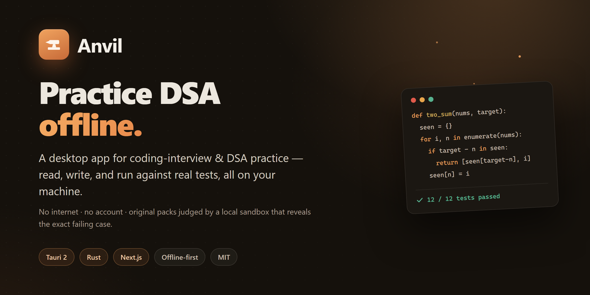
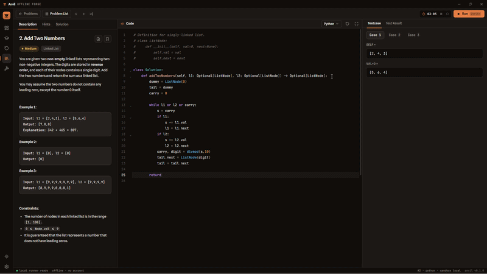

<div align="center">



### The free, offline, honest way to master DSA

A guided course that plugs into the problems you already practice: learn each pattern with animated diagrams, check yourself with a quick quiz, then bring your own LeetCode problem and run your solution against real test cases — **fully offline, no account, no AI crutch.**

[](https://github.com/kudzaiprichard/anvil/actions/workflows/ci.yml)
[](./LICENSE)
[](https://tauri.app)
[](https://nextjs.org)
[](https://www.rust-lang.org)
[](./CONTRIBUTING.md)

[Getting started](#getting-started) · [Features](#features) · [Architecture](#architecture) · [Roadmap](#roadmap) · [Contributing](#contributing) · [Legal](#problem-content--legal)

</div>

---

## What is Anvil?

**Anvil** is building the practice tool you'd actually want for a real interview: not a wall of random
problems, but a **guided course**. For each pattern you get a short lesson with an **animated diagram**,
a quick **concept quiz**, and *then* a curated set of problems to master it. You bring the statements,
write your solution in an in-app editor, and it's judged against real test cases in a **sandboxed local
runtime** on your own machine. No sign-up, no network, no telemetry.

Two things make it different from the usual prep sites and the offline clones:

- **It's honest practice.** Fully offline, with **no AI assistant to lean on** — you build the pattern
  recognition that survives an in-person, whiteboard, or AI-restricted interview. (In 2026 companies are
  increasingly bringing interviews back in-person specifically to counter AI-assisted cheating.)
- **Its judging is provably correct, not answer-keyed.** Every problem is judged by executing reference
  solutions against an **independent brute-force oracle**, cross-checked across languages — so a wrong
  solution can never be marked right. Everything Anvil ships — lessons, drills, and judges — is
  **100% original and MIT-licensed**; the problem statements stay on your machine.

> ### Project status — `0.4.0`
>
> **Shipping now:** the desktop shell, the sandboxed code runner (Python & JavaScript), the offline
> test-pack judging engine (**3,000+ verified packs**), **and the guided course** — a mastery-gated climb
> of **8 stages / 19 units / 62 lessons** with prediction diagrams, unlabeled pattern-picker drills,
> hint-free timed gates, a graduated hint ladder, deterministic complexity feedback, FSRS spaced review,
> and a Stage-7 unlabeled capstone (see the [roadmap](#roadmap)). The lessons, diagrams, judges, and
> curriculum ship in the app; you supply the LeetCode **statements** locally, and everything clicks into
> place by slug — the app ships with an **empty problem library by design** ([why](#problem-content--legal)).

## Demo

<div align="center">
  
  <br />
  <sub>A look at the current build. Product screens continue to land with the roadmap.</sub>
</div>

## Table of contents

- [Why Anvil](#why-anvil)
- [Features](#features)
- [Tech stack](#tech-stack)
- [Getting started](#getting-started)
- [Project structure](#project-structure)
- [Architecture](#architecture)
- [Problem content & legal](#problem-content--legal)
- [Roadmap](#roadmap)
- [Contributing](#contributing)
- [Community & support](#community--support)
- [License](#license)

## Why Anvil

Interview prep tools force a trade-off. Online judges are convenient but need an account and a network,
lock you to their catalog, and — increasingly — assume you'll have an AI copilot. The existing *offline*
tools fix the privacy problem but hand you a bare judge and a flat list of problems: no teaching, no
path, no reason to reach for one technique over another.

Anvil aims to be the best of both — a real course you own:

- **Taught, not just tested.** Each pattern comes with a lesson, an **animated diagram**, and a quiz
  *before* the practice set — so you learn *when* to reach for a technique, not just grind problems.
- **A real learning path.** Concepts stack in a mastery ladder (arrays → two pointers → sliding window →
  trees → graphs → DP): earlier skills are reused later, and nothing unlocks until you've earned it.
- **Honest by design.** Fully offline, **no AI crutch** — you build the pattern recognition that holds up
  in an in-person or AI-restricted interview.
- **Trustworthy judging without answer keys.** Problems are judged by executing reference solutions
  against an *independent brute-force oracle*, cross-checked across languages — a wrong solution can't be
  marked correct.
- **Yours to own.** MIT-licensed — every lesson, drill, and judge is original — no accounts, no tracking.
  Take it on a plane; it just works.

## Features

| | |
|---|---|
| 🎓 **Guided DSA course** | One mastery-gated climb — 8 stages / 19 units / 62 lessons. Each lesson teaches one sub-pattern with an explainer, explicit trigger signals, an interactive prediction diagram, a worked example, and faded → independent practice. Content is data; the engine is code. |
| 🧩 **Pattern-recognition trainer** | Prompt-only, *unlabeled* pattern-picker drills (per lesson + a cross-unit interleaved pool) that train *which* technique an unfamiliar problem needs — the moat. |
| 🛡️ **Mastery gates** | Fresh, unseen problems (≥1 novel) solved **hint-free, no-peek, under a soft timer** to unlock the next unit. A prerequisite DAG drives parallel unlocking, with diagnostic placement and spiral reuse. |
| 🔁 **FSRS spaced review** | Solved problems return on an on-device (`fsrs-rs`) spaced, interleaved schedule and are re-solved *cold*. Honest habit layer — streaks with freezes, no XP, no leaderboards. |
| 💡 **Richer feedback** | Graduated Socratic hint ladder (off on gates), deterministic complexity feedback from op-count traces, and a self-explanation gate before the solution unlocks. |
| 🖥️ **Native desktop app** | Tauri 2 shell — small, fast, and cross-platform (Windows, macOS Apple Silicon + Intel, Linux). |
| 🔒 **Sandboxed code runner** | Runs Python & JavaScript in an isolated subprocess with a per-run timeout, memory cap, and temp-dir isolation (Job Objects on Windows). User code **never** runs in the WebView. |
| ✅ **Oracle-verified judging** | 3,000+ test packs with **no hand-typed answer keys** — expected outputs are computed by executing reference solutions and cross-checking Python vs JavaScript vs a brute-force oracle. |
| 📝 **In-app code editor** | CodeMirror 6 with language modes for Python and JavaScript. |
| 🔌 **Bring-your-own catalog** | A name-agnostic loader maps any local `catalog*.json` to the right hidden judge by slug — swap or merge catalogs with zero code changes. |
| 🔎 **Zero-config runtimes** | Auto-detects a compatible Python (≥ 3.10) and Node (≥ 18) on your `PATH` and reports status in Settings. |
| 🎨 **Considered design system** | Custom "forged iron & ember" (OKLCH) theme, with first-class light & dark modes. |

## Tech stack

| Layer | Technology |
|---|---|
| **UI** | [Next.js 16](https://nextjs.org) (App Router, static export) · React 19 · TypeScript 5 |
| **Editor** | [CodeMirror 6](https://codemirror.net) (Python / JavaScript modes) |
| **Styling** | [Tailwind CSS v4](https://tailwindcss.com) · custom "forged iron & ember" OKLCH theme via `next-themes` |
| **Desktop shell** | [Tauri 2](https://tauri.app) (Rust) — small binaries, fast startup, cross-platform |
| **Backend / runner** | Rust — sandboxed execution, judging, local SQLite (`rusqlite`), pack/catalog loading |
| **Tooling** | Python build pipeline (`tools/build_packs.py`) that verifies and freezes test packs |

The frontend is exported as static assets (`output: 'export'`) and served by Tauri; all native work
(code execution, storage) lives on the Rust side.

## Getting started

Pre-built installers (Linux, macOS Apple Silicon + Intel, Windows) are published to
[**kudzaiprichard/anvil-releases**](https://github.com/kudzaiprichard/anvil-releases/releases) — a
separate repo dedicated to release binaries, kept apart from this source repo. Each release is cut only
by the maintainer, with **signed, verified commits and tags** ([how](./RELEASING.md#release-integrity--signed-commits--tags)).
You can also run Anvil from source below.

### Prerequisites

- **Node.js** 20+ and npm
- **Rust** (stable) + Cargo — required for the desktop shell ([install](https://www.rust-lang.org/tools/install))
- **Platform webview deps** for Tauri ([full list](https://tauri.app/start/prerequisites/)):
  - **Windows** — WebView2 (preinstalled on Windows 11)
  - **macOS** — Xcode Command Line Tools
  - **Linux** — `webkit2gtk` and related packages
- *(Optional, to actually run solutions)* a Python ≥ 3.10 and/or Node ≥ 18 on your `PATH`

### Run it

```bash
git clone https://github.com/kudzaiprichard/anvil.git
cd anvil
npm install

# Desktop app — starts the dev server and opens the Tauri window
npm run tauri dev

# Or just the web layer (theme + components) at http://localhost:3000
npm run dev
```

> In a plain browser (`npm run dev`) the UI runs against a **mock backend** so it can be iterated
> without Rust. The real runner and judging are only available inside the Tauri window.

### Build

```bash
# Static export of the frontend -> ./out
npm run build

# Desktop installers (.exe / .dmg / .AppImage, per platform) -> src-tauri/target/release/bundle
npm run tauri build

# Or just the app binary, no installers
npm run tauri build -- --no-bundle
```

## Project structure

```
app/                    Next.js App Router — layout, pages, globals.css (theme tokens)
src/
  components/
    shadcn/             generated shadcn/ui components (button, card, badge, input, …)
    providers.tsx       next-themes provider (class-based dark mode)
  lib/
    api/index.ts        the single UI ⇄ backend seam (real Tauri backend / browser mock)
    types.ts            TypeScript IPC contract (mirrors the Rust domain types)
    utils.ts            cn() class-merge helper
src-tauri/              Tauri 2 desktop shell (Rust)
  src/
    commands/           thin IPC glue
    domain/             pure types — the serde shapes that ARE the IPC contract
    services/           runner, judging, SQLite, pack/catalog loading
  resources/            frozen test-packs.json.gz + curriculum/ + lessons/ + catalog/ (your catalog*.json)
  tauri.conf.json       app + window configuration
tools/
  build_packs.py        offline pipeline: verify references against the oracle, freeze packs
  build_curriculum.py   fail-closed --check for the course content (DAG, lesson parts, slugs)
  check_release_boundary.py  release gate: never bundle a *leetcode* catalog (see RELEASING.md)
  packs/                per-problem test packs (reference solutions, oracles, generators, hints)
components.json          shadcn/ui configuration
next.config.ts          Next config (static export for Tauri)
```

## Architecture

Anvil is a **Tauri 2 desktop shell** wrapping a **Next.js static-export** frontend. The WebView never
executes user code — it sends code over IPC to the Rust backend, which runs it in a sandboxed subprocess
(timeout + memory cap + temp-dir isolation; Job Objects on Windows) and returns a verdict.

- **Backend layering** (`src-tauri/src/`) — thin `commands/` (IPC glue) over Tauri-free `domain/` (pure
  types whose serde shapes are the IPC contract, matching `src/lib/types.ts`) and `services/` (runner,
  SQLite, pack/catalog loading). Domain + services unit-test as plain Rust.
- **One data seam** — all UI data access goes through `src/lib/api/index.ts`: the real backend inside
  Tauri, a mock in a plain browser so the UI can be built with `npm run dev`.
- **Test packs are the judge.** Each problem's pack has **no hand-typed answer key** — it carries
  reference solutions plus an independent brute-force oracle. The offline build
  (`tools/build_packs.py`) computes expected outputs by *executing* the references in the same sandbox
  harness the app uses, cross-checking Python vs JavaScript vs the oracle. A wrong solution is
  quarantined, never frozen. Verified packs are frozen into `src-tauri/resources/test-packs.json.gz`.
- **Runtimes are auto-detected** — the app probes `PATH` for a compatible Python (≥ 3.10) and Node
  (≥ 18), resolves the real interpreter path, and reports status in Settings. No manual configuration.
- **Adding a language is additive** — the pack schema is already per-language. Write a sandbox harness +
  runner in Rust, register it in the build, then generate one reference solution per problem (verified
  by agreement against the stored expecteds). TypeScript ≈ free (rides the JS harness); compiled
  languages each add a harness + runner.

## Problem content & legal

Anvil ships **only original content**: the source code and the **test packs** (reference solutions,
oracles, generators, hints). It ships **no third-party problem statements** — and specifically **no
LeetCode content**. Out of the box the problem library is therefore **empty**.

**Statements are supplied by you, locally.** The catalog loader is deliberately *name-agnostic*: drop
any file named `catalog*.json` (or `catalog*.json.gz`) into `src-tauri/resources/catalog/`, and at
startup Anvil discovers it, loads every entry, and maps each one to its frozen test pack **by slug** —
that matched pack becomes the hidden judge. Multiple catalogs merge (de-duplicated by slug).

```
src-tauri/resources/
  catalog/
    catalog.json[.gz]         # an ORIGINAL catalog you author → committable & shippable
    catalog_<anything>.json   # any additional catalog, picked up automatically
  test-packs.json.gz          # the frozen, original judges (this repo ships these)
```

- ✅ An **original** catalog you author yourself may be committed and shipped.
- ⛔ A catalog of **third-party** statements (e.g. scraped from LeetCode) is **your local data for
  personal use only** — never redistribute or commit it. The repo hard-ignores any `*leetcode*` catalog
  to prevent accidents. Anvil provides no scraper and does not download content.

Platforms such as **LeetCode** let *individuals* access problems for their own practice, but their
Terms of Service do **not** allow a company, competition, or product to reuse or redistribute that
content. So any catalog you assemble is for your **personal, individual, offline use only** — keep it on
your machine, and don't redistribute, publish, or ship it. You are responsible for ensuring any content
you load complies with its source's copyright and Terms of Service. **Full details are in
[DISCLAIMER.md](./DISCLAIMER.md).** Everything Anvil itself ships stays original by rule — see
[CONTRIBUTING.md](./CONTRIBUTING.md).

## Roadmap

| | Milestone |
|---|---|
| ✅ | Desktop shell (Tauri) over the Next.js static export |
| ✅ | Design system — custom "forged iron & ember" (OKLCH) theme, light & dark |
| ✅ | Local code runner — run/test Python & JavaScript with timeouts and sandboxing (Rust) |
| ✅ | Test-pack judging — 3,000+ verified packs frozen into the app (oracle-checked, no answer keys) |
| ✅ | Name-agnostic catalog loader — bring-your-own statements, mapped to packs by slug |
| ✅ | **Guided course** — 8 stages / 19 units / 62 lessons: diagrams, quizzes, pattern-picker, mastery ladder |
| ✅ | Mastery gates + prerequisite-DAG unlocking, diagnostic placement, Stage-7 unlabeled capstone |
| ✅ | FSRS spaced review + progress tracking (local SQLite, no account) |
| ✅ | User-authored problems — write & validate your own original problems in the app |
| ⬜ | More languages — TypeScript, then compiled languages |

## Contributing

Contributions are welcome — code, **original** test packs & lessons, docs, design, and more. Good first
steps:

1. Read [CONTRIBUTING.md](./CONTRIBUTING.md) — dev setup, the PR flow, and the one non-negotiable rule
   for the content Anvil ships (it must be **100% original**; problem statements are always
   bring-your-own).
2. Browse [issues](https://github.com/kudzaiprichard/anvil/issues) or open a
   [discussion](https://github.com/kudzaiprichard/anvil/discussions) to propose something.
3. Fork → branch → PR. **All changes land via pull request** with passing CI and a maintainer review;
   `main` is protected (no direct pushes, no force-pushes). Details in
   [CONTRIBUTING.md](./CONTRIBUTING.md#branch-protection--merge-rules).

By participating you agree to our [Code of Conduct](./CODE_OF_CONDUCT.md). For security issues, please
follow [SECURITY.md](./SECURITY.md) instead of opening a public issue.

## Community & support

- 💬 **Questions & ideas** — [GitHub Discussions](https://github.com/kudzaiprichard/anvil/discussions)
- 🐛 **Bugs & features** — [open an issue](https://github.com/kudzaiprichard/anvil/issues/new/choose)
- 🔐 **Security** — see [SECURITY.md](./SECURITY.md)
- 📜 **Changes** — tracked in [CHANGELOG.md](./CHANGELOG.md)

If Anvil is useful to you, a ⭐ helps others find it.

## License

[MIT](./LICENSE) © Kudzai P Matizirofa — this covers **all source code and the original test packs**
(solutions, oracles, generators, hints). Anvil ships **no** third-party problem statements; any catalog
of external statements you load is your own local data. See [DISCLAIMER.md](./DISCLAIMER.md) for the full
content & legal policy.

<div align="center"><sub>Built with Tauri, Next.js & Rust.</sub></div>
